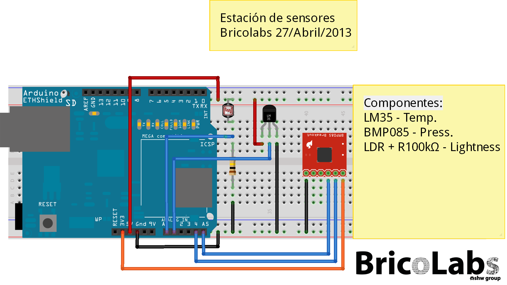

Estación de sensores
==================

Actualmente conta cas seguintes funcionalidades:
 - Sensores de:
    + Altitude
    + Presión
    + Temperatura
    + Luminosidade
    + CO2
 - Conectividade Wifi para a publicación dos datos online (podes velos aquí: https://xively.com/feeds/124735)

Esquema (non actualizado):

